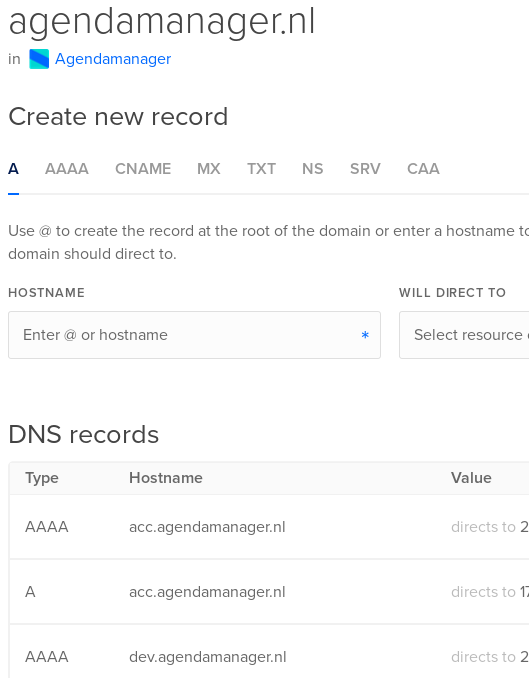

# **DigitalOcean droplet**

## **Table of contents**

1. Preinstallation
2. Nginx
3. Cron
4. Certbot
5. PHPMyAdmin
6. PM2

## **Preinstallation**

When setting up your droplet, DigitalOcean gives you the option to preinstall packages, frameworks, stacks (NodeJS, LAMP/LEMP, Django, etc.) 
For Agendamanager I decided to preinstall NodeJS.

## **Nginx**

Nginx is a web server. 
DigitalOcean offers great resources on how to setup [Nginx](https://www.digitalocean.com/community/tutorials/how-to-install-nginx-on-ubuntu-18-04).
Below I'll list the folder structure and some commands which I commonly use

All files that you want to serve with the webserver are in:

    /var/www/html

agendamanager.nl's configuration file can be found in:

    /etc/nginx/sites-available/agendamanager.nl

The config file consists of multiple server blocks, like this:

    server { }

Server blocks are used to host multiple (sub)-domains on a server, in our example we're running agendamanager.nl, dev.agendamanager.nl and acc.agendamanager.nl on the same server. There are also server blocks for HTTP and HTTPS traffic for each of these servers.

 

Nginx has the ability to use snippets (reusable code). I use these for the SSL, PHPMyAdmin and NodeJS configuration. They can be found in:

    /etc/nginx/snippets

 

When changing anything in Nginx's configuration file (this includes snippets) it's good practice to make sure the file does not have any syntax errors by running this command:

    nginx -t

If you forget to do this (as I have done plenty of times), check the status of Nginx:

    systemctl status nginx

Then fix your errors and restart it:

    systemctl start nginx

If you need to stop running Nginx for whatever reason:

    systemctl stop nginx

If you're making updates to the Nginx configuration file and don't want to take the server offline, you can hot reload Nginx:

    systemctl reload nginx

 

## **Cron**

Cron is the most used scheduler for Linux. With Cron you can automate repetitive tasks such as pulling changes from the GitHub repository and schedule them. Use [crontab.guru](crontab.guru) to learn how the scheduler works.

List cron tasks:

    crontab -l

Edit cron tasks:

    crontab -e

 

## **Certbot**

Certbot is a free tool for automatically obtaining Let's Encrypt certificates to enable HTTPS on your server.

As with most tools DigitalOcean has a great tutorial on how to use [Certbot](https://www.digitalocean.com/community/tutorials/how-to-secure-nginx-with-let-s-encrypt-on-ubuntu-18-04)

Below I'll list some things you might glance over when reading this tutorial but which are super important to know to successfully obtain your Let's Encrypt certificate

> Valid IPv4 and IPv6 address

You need a valid **A** record (IPv4) and **AAAA** record (IPv6). Even if you don't use IPv6 yourself it still has to be configured properly otherwise the certbot certificate challenge will fail.

> DNS records

You'll need to set up the DNS records for your domain with a DNS hosting service (in our case, this is Neostrada).

Next, you need to set up the DNS records on DigitalOcean. Log in at DigitalOcean, and go to the networking tab

Each domain and sub-domain needs a valid **A** and **AAAA** record.

> Renewal

Certbot will automatically add a cron task that runs twice every day to check if a certificate renewal is needed. In case you need to test if the auto renewal process works, use this command:

    certbot renew --dry-run
 

## **PHPMyAdmin**

Follow the tutorial [here](https://www.digitalocean.com/community/tutorials/how-to-install-and-secure-phpmyadmin-with-nginx-on-an-ubuntu-18-04-server).

Disabling root access is recommended, to do so go to:

    /etc/phpmyadmin/config.inc.php

Add (or change) these two lines:

    $cfg['Servers'][$i]['auth_type'] = 'cookie';
    $cfg['Servers'][$i]['AllowRoot'] = false;

To further secure PMA there are additional steps you can take such as IP-based access. Currently I have not enabled this.

## **PM2**

PM2 is a process manager for NodeJS applications. It's very useful for having a quick overview of all running NodeJS applications and restarting them when needed.

Installation:

    npm install pm2 -g

Starting a NodeJS application:

    pm2 start index.js

(replace index.js with the name of your NodeJS app)

Stopping a NodeJS application:

    pm2 stop index.js

Deleting a NodeJS application from the list of monitored apps (this will not delete the file itself)

    pm2 delete index.js

View all current running applications

    pm2 monit

Save all current processes (when the droplet is offline or reboots this will activate all the saved NodeJS applications on startup)

    pm2 save

Update startup script

    pm2 unstartup

Then:

    pm2 startup

